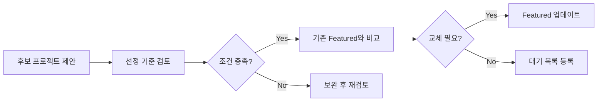

# MVP 프로젝트 분류 기준표

> **버전**: 1.0  
> **최종 수정일**: 2026-01-22  
> **적용 대상**: 83개 전체 MVP 프로젝트

---

## 📋 목차
1. [분류 체계 개요](#1-분류-체계-개요)
2. [카테고리 정의](#2-카테고리-정의)
3. [프로젝트 속성 정의](#3-프로젝트-속성-정의)
4. [분류 기준표](#4-분류-기준표)
5. [Featured 선정 기준](#5-featured-선정-기준)

---

## 1. 분류 체계 개요

### 1.1 분류 차원

MVP 프로젝트는 다음 4가지 차원으로 분류됩니다:

```
차원 1: 카테고리 (4개 대분류)
  └── 기업·기관 홈페이지
  └── 교육·AI 플랫폼
  └── SaaS·업무자동화
  └── 공공·예약·문화

차원 2: 서비스 유형
  └── 웹사이트 / 웹앱 / 시스템 / 플랫폼

차원 3: 운영 상태
  └── 실제 서비스 / 시범 운영 / MVP 검증

차원 4: 공개 수준
  └── 전체 공개 / 제한 공개 / 내부 전용
```

---

## 2. 카테고리 정의

### 2.1 기업·기관 홈페이지

**정의:**  
기업, 기관, 단체의 브랜드와 서비스를 소개하는 공식 웹사이트

**주요 특징:**
- 회사/기관 소개
- 제품/서비스 안내
- 고객 사례 및 포트폴리오
- 문의/상담 기능

**대표 프로젝트:**
| 프로젝트명 | ID | 타입 |
|-----------|-------|------|
| 바이칼시스템즈 홈페이지 | mvp-04 | IT 솔루션 기업 |
| 디비인포 리뉴얼 | dbinfo-final | 데이터 컨설팅 |
| 한국코프론 홈페이지 | mvp-03 | 제조업 |
| 광연자동차전문학원 | gen-30 | 교육기관 |
| 한국환경안전연구소 | ketri-01 | 연구소 |

**하위 분류:**
- 제조·IT 솔루션
- 전문 서비스
- 교육기관
- 연구소·협회
- 의료·병원

---

### 2.2 교육·AI 플랫폼

**정의:**  
교육 콘텐츠 제공, 학습 관리, AI 기반 분석을 포함하는 플랫폼

**주요 특징:**
- 학습자/강사 관리
- 콘텐츠 관리 시스템
- 진도/성과 추적
- AI 추천/분석

**대표 프로젝트:**
| 프로젝트명 | ID | 타입 |
|-----------|-------|------|
| AI 기반 맞춤형 교육 플랫폼 | jdx-01 | AI 학습 추천 |
| 직장인을 위한 AI 교육 플랫폼 | jdx-02 | 직무 교육 |
| AI 로또 번호 생성기 | jdx-20 | AI 분석 |
| 프리미엄 코인 추천 웹앱 | jdx-30 | AI 투자 분석 |

**하위 분류:**
- 에듀테크
- AI 분석
- 데이터 시각화
- 학습 관리 시스템(LMS)

---

### 2.3 SaaS·업무자동화

**정의:**  
기업 업무 효율화, 협업 도구, 자동화 시스템

**주요 특징:**
- 업무 관리 대시보드
- 팀 협업 기능
- 자동화 워크플로우
- 데이터 통합

**대표 프로젝트:**
| 프로젝트명 | ID | 타입 |
|-----------|-------|------|
| Vibe Office Hub | gen-01 | 올인원 업무 관리 |
| Vibe Finance Hub | gen-02 | 재무 관리 |
| 모바일 디지털 작업지시서 | mxten-06 | 현장 관리 |
| 디비인포 관리자 페이지 | dbinfo-admin | 관리자 시스템 |

**하위 분류:**
- 프로젝트 관리
- 재무/회계 관리
- 협업 도구
- 문서 관리
- 현장 관리

---

### 2.4 공공·예약·문화

**정의:**  
공공 서비스, 예약 시스템, 문화·예술 플랫폼

**주요 특징:**
- 예약/신청 시스템
- 실시간 현황 관리
- 회원 인증
- 결제 연동

**대표 프로젝트:**
| 프로젝트명 | ID | 타입 |
|-----------|-------|------|
| 바이칼 리조트 예약 | mvp-26 | 숙박 예약 |
| 문학 플랫폼 | baikal-01 | 문화 콘텐츠 |
| 도서관 예약 시스템 | grok-57 | 시설 예약 |
| 국회의원 랜딩페이지 | lawmaker-landing | 공공 홍보 |

**하위 분류:**
- 예약 시스템
- 공공기관 서비스
- 문화·예술
- 관광·숙박
- 행정 서비스

---

## 3. 프로젝트 속성 정의

### 3.1 필수 속성

| 속성 | 타입 | 설명 | 예시 |
|------|------|------|------|
| **id** | string | 고유 식별자 | `ketri-01` |
| **title** | string | 프로젝트명 (한글) | `한국환경안전연구소` |
| **slug** | string | URL 경로용 | `ketri-homepage` |
| **category** | enum | 4대 카테고리 | `기업·기관 홈페이지` |
| **oneLiner** | string | 한 줄 설명 | `공공 기관의 신뢰성 강화` |
| **features** | string[] | 핵심 기능 3가지 | `['연구 성과', '공지사항', '조직도']` |
| **fitFor** | string | 적합 고객 | `연구소·협회, 공공기관` |
| **thumbnail** | string | 썸네일 경로 | `/images/ketri-homepage.webp` |
| **stack** | string[] | 기술 스택 | `['React', 'TypeScript']` |
| **tags** | string[] | 태그 | `['연구소', '공공기관']` |
| **featured** | boolean | Featured 여부 | `true` |
| **yearMonth** | string | 출시 연월 | `2026-01` |

### 3.2 선택 속성

| 속성 | 타입 | 설명 | 예시 |
|------|------|------|------|
| **demoUrl** | string? | 데모 URL | `https://ketri-project-01.vercel.app/` |
| **screenshots** | string[] | 스크린샷 목록 | `['/images/ketri-01.webp']` |
| **serviceType** | enum? | 서비스 유형 | `웹사이트` / `웹앱` / `시스템` / `플랫폼` |
| **operationStatus** | enum? | 운영 상태 | `실제서비스` / `시범운영` / `MVP검증` |
| **accessLevel** | enum? | 공개 수준 | `전체공개` / `제한공개` / `내부전용` |

---

## 4. 분류 기준표

### 4.1 서비스 유형 분류

| 유형 | 정의 | 특징 | 예시 |
|------|------|------|------|
| **웹사이트** | 정보 제공 중심 | - 회사 소개<br>- 콘텐츠 열람<br>- 정적 페이지 | 기업 홈페이지,<br>랜딩페이지 |
| **웹앱** | 인터랙티브 기능 | - 로그인/회원<br>- CRUD 기능<br>- 동적 콘텐츠 | 예약 시스템,<br>교육 플랫폼 |
| **시스템** | 업무 처리 중심 | - 관리자 기능<br>- 데이터 처리<br>- 워크플로우 | 작업 지시서,<br>관리자 페이지 |
| **플랫폼** | 다수 사용자 참여 | - 양방향 소통<br>- 콘텐츠 생성<br>- 커뮤니티 | 문학 플랫폼,<br>교육 플랫폼 |

### 4.2 운영 상태 분류

| 상태 | 정의 | 조건 | 예시 |
|------|------|------|------|
| **실제 서비스** | 정식 운영 중 | - 실제 사용자 존재<br>- 유료/무료 서비스<br>- 지속 운영 | 바이칼시스템즈,<br>디비인포 |
| **시범 운영** | 테스트 운영 중 | - 제한된 사용자<br>- 피드백 수집<br>- 개선 진행 중 | 신규 플랫폼 |
| **MVP 검증** | 컨셉 검증 단계 | - 데모 목적<br>- 기능 검증<br>- 상품화 전 | 프로토타입 |

### 4.3 공개 수준 분류

| 수준 | 정의 | 접근 범위 | 포트폴리오 노출 |
|------|------|----------|----------------|
| **전체 공개** | 누구나 접근 가능 | - 데모 URL 공개<br>- 포트폴리오 게재<br>- 스크린샷 공개 | ✅ Featured 가능<br>✅ 상세 정보 제공 |
| **제한 공개** | 일부 정보만 공개 | - 데모 URL 비공개<br>- 개요만 게재<br>- 일부 스크린샷 | ⚠️ Featured 가능<br>⚠️ 제한적 정보 |
| **내부 전용** | 포트폴리오 미게재 | - 내부 관리용<br>- 포트폴리오 제외<br>- 비밀 유지 | ❌ Featured 불가<br>❌ 포트폴리오 제외 |

---

## 5. Featured 선정 기준

### 5.1 Featured 프로젝트 정의

**Featured = 대표 프로젝트**
- 전체 83개 중 상위 12개 선정
- 포트폴리오 메인 페이지 하이라이트
- 제안서/상담 시 우선 소개

### 5.2 Featured 선정 조건

#### 필수 조건 (AND)
- [ ] 데모 URL이 정상 작동
- [ ] 고품질 썸네일 보유
- [ ] 프로젝트 설명 완비
- [ ] 공개 가능 (전체 공개 또는 제한 공개)

#### 우대 조건 (OR - 2개 이상 충족)
- [ ] 실제 서비스 운영 중
- [ ] 고객사 인지도 높음
- [ ] 기술 스택 다양성
- [ ] 카테고리 대표성
- [ ] 최신 프로젝트 (6개월 이내)
- [ ] 복잡도 높음 (난이도 hard 이상)

### 5.3 카테고리별 Featured 배분

| 카테고리 | Featured 수 | 비율 |
|----------|-------------|------|
| 기업·기관 홈페이지 | 5개 | 42% |
| 교육·AI 플랫폼 | 2개 | 17% |
| SaaS·업무자동화 | 2개 | 17% |
| 공공·예약·문화 | 3개 | 25% |
| **합계** | **12개** | **100%** |

### 5.4 현재 Featured 12개 목록

| # | ID | 프로젝트명 | 카테고리 | 선정 이유 |
|---|-------|-----------|----------|----------|
| 1 | mvp-04 | 바이칼시스템즈 홈페이지 | 기업·기관 | 자사 프로젝트, 기술력 과시 |
| 2 | dbinfo-final | 디비인포 리뉴얼 | 기업·기관 | 실제 서비스, 고품질 디자인 |
| 3 | mvp-03 | 한국코프론 홈페이지 | 기업·기관 | 제조업 대표, 안정적 운영 |
| 4 | gen-30 | 광연자동차전문학원 | 기업·기관 | 지역 서비스, 실제 운영 |
| 5 | ketri-01 | 한국환경안전연구소 | 기업·기관 | 공공기관, 신뢰성 |
| 6 | jdx-01 | AI 기반 맞춤형 교육 플랫폼 | 교육·AI | AI 기술, 플랫폼 복잡도 |
| 7 | jdx-02 | 직장인 AI 교육 플랫폼 | 교육·AI | 타겟 명확, AI 추천 |
| 8 | gen-01 | Vibe Office Hub | SaaS | 자체 브랜드, 업무 자동화 |
| 9 | gen-02 | Vibe Finance Hub | SaaS | 재무 관리, 차별화 |
| 10 | mvp-26 | 바이칼 리조트 예약 | 공공·예약 | 예약+결제, 복잡 시스템 |
| 11 | baikal-01 | 문학 플랫폼 | 공공·예약 | 문화 플랫폼, 커뮤니티 |
| 12 | grok-57 | 도서관 예약 시스템 | 공공·예약 | 공공 서비스, 실용성 |

### 5.5 Featured 변경 프로세스



---

## 6. 프로젝트 분류 예시

### 6.1 케이스 스터디: 한국환경안전연구소

```typescript
{
  // 기본 정보
  id: 'ketri-01',
  title: '한국환경안전연구소 공식 홈페이지',
  slug: 'ketri-homepage',
  
  // 분류
  category: '기업·기관 홈페이지',
  serviceType: '웹사이트',
  operationStatus: '실제서비스',
  accessLevel: '전체공개',
  
  // Featured
  featured: true,
  featuredReason: '공공기관 대표 사례, 신뢰성 높은 디자인',
  
  // 기타
  oneLiner: '공공 기관의 신뢰성을 강화하는 공식 웹사이트',
  fitFor: '연구소·협회, 공공기관, 비영리단체',
  tags: ['연구소', '공공기관', '환경', '안전'],
  stack: ['React', 'TypeScript', 'TailwindCSS', 'Firebase'],
  
  // URL
  demoUrl: 'https://ketri-project-01.vercel.app/',
  thumbnail: '/images/ketri-homepage.webp',
}
```

### 6.2 케이스 스터디: Vibe Office Hub

```typescript
{
  // 기본 정보
  id: 'gen-01',
  title: 'Vibe Office Hub',
  slug: 'vibe-office-hub',
  
  // 분류
  category: 'SaaS·업무자동화',
  serviceType: '플랫폼',
  operationStatus: 'MVP검증',
  accessLevel: '제한공개',
  
  // Featured
  featured: true,
  featuredReason: '자체 브랜드 SaaS, 업무 자동화 대표 사례',
  
  // 기타
  oneLiner: '중소기업을 위한 올인원 업무 관리 플랫폼',
  fitFor: '10~50인 스타트업, 원격 근무 팀',
  tags: ['협업툴', 'SaaS', '업무관리', '중소기업'],
  stack: ['React', 'TypeScript', 'Firebase', 'TailwindCSS'],
  
  // URL
  demoUrl: 'https://gen-project-01.vercel.app/',
  thumbnail: '/images/vibe-office-hub.webp',
}
```

---

## 7. 분류 검증 체크리스트

### 신규 프로젝트 등록 시
- [ ] 4대 카테고리 중 하나를 선택했는가?
- [ ] 서비스 유형이 명확히 정의되었는가?
- [ ] 운영 상태가 정확한가?
- [ ] 공개 수준이 결정되었는가?
- [ ] Featured 선정 기준을 검토했는가?

### Featured 선정 시
- [ ] 필수 조건 4가지를 모두 충족하는가?
- [ ] 우대 조건 2개 이상 충족하는가?
- [ ] 카테고리 배분이 적절한가?
- [ ] 기존 Featured와 중복되지 않는가?
- [ ] 장기적으로 유지 가능한가?

---

**문서 관리:**
- 작성자: 바이브 코딩 개발팀
- 승인자: 프로젝트 매니저
- 다음 리뷰 예정일: 2026-04-22
